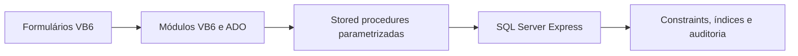

# SEV — Estoque e Vendas em VB6 e SQL Server

Aplicação desktop local para cadastro de produtos e serviços, estoque, caixa e vendas. Desenvolvida em **Visual Basic 6**, **ADO** e **SQL Server Express**, com regras de persistência e operações financeiras concentradas em stored procedures.

O projeto demonstra manutenção e evolução de uma aplicação desktop legada, modelagem relacional, transações, controle de concorrência e integração com banco de dados. A próxima etapa planejada é a modernização visual e a adaptação das telas ao redimensionamento.

## Exemplo de negócio

Uma venda pode conter uma película de R$ 20,00 e sua aplicação de R$ 15,00. O total é R$ 35,00, mas apenas a película reduz o estoque. Ao cancelar, o sistema repõe o produto e registra os estornos financeiros sem apagar o histórico.

## Para conhecer o trabalho em SQL

| Tema | Onde consultar |
|---|---|
| Tabelas, PK/FK, CHECK, índices e dados iniciais | [Estrutura inicial](database/estrutura/001_EstruturaInicial.sql) |
| Venda transacional, pagamentos, estoque e cancelamento | [Operações](database/migracoes/003_Operacoes.sql) — `usp_FinalizarVenda`, `usp_CancelarVenda` |
| Concorrência e idempotência | No mesmo arquivo: bloqueios `UPDLOCK/HOLDLOCK`, `sp_getapplock` e chave única da operação |
| Edição concorrente de cadastros | [Cadastros e rowversion](database/migracoes/002_Cadastros.sql) |
| Auditoria com valores anteriores e novos | [Triggers](database/migracoes/005_AuditoriaCadastros.sql) |
| View, painel e agregações por item | [Painel e relatórios](database/migracoes/006_PainelRelatorios.sql) |
| JOIN, GROUP BY e consulta por período | [Exemplo analítico](database/consultas/001_VendasPorPeriodo.sql) |
| Testes de integração e regras inválidas | [Executar-Testes.ps1](database/testes/Executar-Testes.ps1) |

O banco atualizado possui **17 tabelas, 45 procedures, 5 triggers e 1 view**. O [inventário SQL](docs/INVENTARIO_SQL.md) relaciona cada módulo ao seu arquivo. Não há dump de clientes, usuários, senhas ou vendas neste repositório.

## Funcionalidades

- Login e perfis de administrador, gerente e vendedor.
- Categorias, fornecedores, clientes, produtos e serviços; pesquisa, edição e inativação.
- Entrada e saída de estoque, estoque mínimo e histórico de movimentações.
- Abertura/fechamento de caixa, suprimento e sangria.
- PDV com produtos e serviços, pagamento misto, troco e limites de desconto.
- Cancelamento, histórico, relatórios, exportação CSV e painel do dia.
- Auditoria e backup/restauração controlada.

Pagamento em PIX e cartões é um **registro manual**, sem comunicação com banco ou adquirente. Emissão fiscal, TEF, impressão e ordem de serviço estão fora do escopo.

## Arquitetura



Os itens da venda preservam descrição, preço e custo da época. A finalização grava venda, itens, pagamentos e movimentos em uma transação. A repetição da mesma chave de operação não duplica a venda. Cadastros usam `rowversion` para detectar edição simultânea.

Senhas são derivadas com PBKDF2-HMAC-SHA256, salt aleatório e 600 mil iterações via BCrypt do Windows. A sessão é validada no banco. Os perfis internos não limitam administradores do Windows/SQL Server, que continuam tendo acesso direto ao banco.

## Executar em outra máquina

**Pré-requisitos:** Windows, ambiente VB6 licenciado para compilar, referência ADO 2.8, driver Microsoft OLE DB 19 com suporte de 32 bits e SQL Server Express. Os scripts usam recursos do SQL Server **2016 SP1 ou posterior**; foram validados na instância Express 17 do desenvolvimento.

1. Clone o repositório e entre em sua pasta.
2. Instale o banco em uma instância local, usando PowerShell:

   ```powershell
   .\database\Instalar-Banco.ps1 -Servidor '.\SQLEXPRESS'
   ```

   Esse comando é para **instalação nova** e recusa um banco de destino que já exista. Não execute no ambiente já instalado para atualizar. A sequência de migrações está em [database/README.md](database/README.md).

3. Abra `src/SistemaEstoqueVendas.vbp` no VB6. Confira a referência **Microsoft ActiveX Data Objects 2.8 Library**.
4. Em `modConexao.bas`, confira instância e banco. A configuração padrão usa autenticação Windows, `.SQLEXPRESS` e `SEV_DB`; não contém senha SQL.
5. Pressione **F5**. No primeiro acesso, crie o administrador com sua própria senha, de 12 a 128 caracteres. Não há senha padrão.

O SQL Server precisa estar em execução. Depois de compilar, o aplicativo pode ser usado pelo executável sem abrir VB6 ou SSMS. Instaladores de terceiros e executáveis compilados não são versionados.

## Testes reproduzíveis

```powershell
.\database\testes\Executar-Testes.ps1 -Servidor '.\SQLEXPRESS'
```

O runner cria um banco exclusivo `SEV_TESTES_<GUID>`, instala os scripts, cria dados fictícios e verifica vendas mistas, troco, estoque, idempotência, cancelamento, fechamento, edição concorrente e permissões. Ao terminar, remove somente o banco criado nessa execução. A conta Windows precisa de permissão para criar e remover esse banco. `-ConservarBanco` mantém o ambiente de teste para inspeção.

O teste de validação de serviços também verifica nome vazio, preço negativo e duração inválida **com uma sessão autenticada**. Consulte [a documentação dos testes](database/testes/README.md) e [o registro de validação](docs/VALIDACAO.md). Não há pipeline hospedado configurado; os testes exigem uma instância SQL Server acessível.

## Estrutura

```text
src/                  Fontes VB6 e projeto .vbp
database/
  estrutura/          Tabelas, constraints, índices e dados iniciais
  migracoes/          Evolução incremental e definições dos módulos SQL
  procedures/         Cópia de referência da procedure original de serviço
  consultas/          Exemplos analíticos somente leitura
  diagnostico/        Inventário e integridade estrutural
  testes/             Testes isolados e reproduzíveis
docs/                 DER, dicionário, arquitetura e guias
```

As migrações são a fonte canônica dos módulos SQL; não há dezenas de cópias concorrentes de cada procedure. A cópia histórica em `procedures/` foi sincronizada com a versão autenticada e não integra a instalação.

Fontes VB6 usam **Windows-1252**; SQL e Markdown usam **UTF-8**. Preserve a codificação dos formulários ao editar. O `.gitignore` exclui backups, arquivos físicos do banco, executáveis, estado do editor e relatórios locais.

## Documentação

- [Arquitetura e regras](docs/ARQUITETURA.md)
- [Diagrama de relacionamentos](docs/DER.md)
- [Dicionário de dados](docs/DICIONARIO.md)
- [Guia de utilização](docs/GUIA_USUARIO.md)
- [Backup e restauração](docs/BACKUP_RESTAURACAO.md)
- [Roteiro técnico para apresentar o projeto](docs/PORTFOLIO_SQL.md)
- [Histórico de mudanças](CHANGELOG.md)

## Próximas melhorias

- Modernização visual com recursos do VB6.
- Redimensionamento de telas, listas e áreas de trabalho.
- Melhor organização do menu e destaque de indicadores.

Esses itens são planejamento; não estão apresentados como funcionalidades já concluídas. A licença de distribuição ainda será definida pelo autor.
