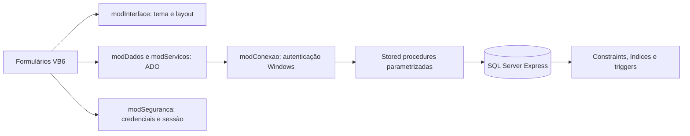

# 🛒 SEV — Sistema de Estoque e Vendas

**Aplicação desktop em Visual Basic 6 e SQL Server Express, com PDV, serviços, controle de estoque e gestão de caixa.**

🖥️ **VB6 + ADO** · 🗄️ **SQL Server / T-SQL** · 🧩 **Stored procedures** · 🎨 **Interface adaptável**

O SEV reúne operações comerciais locais em uma aplicação desktop. O projeto explora a evolução de software legado com foco em integridade dos dados, regras transacionais e organização da interface. A versão **1.2** inclui painel com indicadores, menu lateral e layouts que aproveitam o redimensionamento das janelas.

## 🎯 O problema de negócio

Produtos e serviços podem participar da mesma venda, mas somente produtos movimentam estoque. Uma venda de uma película de **R$ 20,00** com aplicação de **R$ 15,00** precisa registrar R$ 35,00 em pagamentos e baixar apenas uma unidade do produto. Se houver cancelamento, o estoque e o caixa recebem movimentos inversos, preservando o histórico.

Esse cenário orienta a modelagem, as transações e as validações implementadas no banco.

## ✨ Funcionalidades

| Área | Recursos |
|---|---|
| Cadastros | Categorias, clientes, fornecedores, produtos e serviços; pesquisa, edição e inativação |
| Estoque | Entradas, saídas, saldo mínimo e histórico com motivo e responsável |
| PDV | Produtos e serviços na mesma venda, múltiplos pagamentos, troco e limite de desconto por perfil |
| Caixa | Abertura, suprimento, sangria, fechamento e apuração de diferença |
| Gestão | Indicadores do dia, consultas, cancelamentos e exportação CSV |
| Acesso | Administrador, gerente e vendedor; sessão e validação de permissões nas procedures |
| Rastreabilidade | Auditoria de operações e alterações de cadastros |
| Interface | Menu lateral, cartões de indicadores, área de pagamentos e fontes com crescimento controlado |

**Atalhos:** F2 salva cadastros; F3 pesquisa; F4 inicia novo cadastro ou adiciona item no PDV; F9 abre o PDV no painel e finaliza a venda na tela de caixa. As confirmações e permissões existentes continuam sendo aplicadas.

## 🗄️ Engenharia de dados — por onde começar

O schema completo contém **17 tabelas, 45 stored procedures, 5 triggers e 1 view**. Os scripts de criação estão versionados; não é necessário um arquivo de backup para instalar uma base nova.

| O que avaliar | Código e documentação |
|---|---|
| Criação do banco, tabelas, PKs, FKs, CHECKs, índices e valores iniciais | [Estrutura inicial](database/estrutura/001_EstruturaInicial.sql) |
| Ordem de criação e responsabilidade de cada tabela | [Mapa de criação SQL](docs/MAPA_CRIACAO_SQL.md) |
| Tipos, nulabilidade e campos | [Dicionário de dados](docs/DICIONARIO.md) |
| Relacionamentos entre entidades | [Diagrama ER](docs/DER.md) |
| Venda, caixa, estoque e cancelamento | [Operações transacionais](database/migracoes/003_Operacoes.sql) |
| Edição concorrente com `rowversion` | [Procedures de cadastros](database/migracoes/002_Cadastros.sql) |
| Auditoria de valores anteriores e novos | [Triggers de auditoria](database/migracoes/005_AuditoriaCadastros.sql) |
| View e agregações para o painel | [Painel e relatórios](database/migracoes/006_PainelRelatorios.sql) |
| Agregações sem multiplicar itens por pagamentos | [Consulta de vendas por período](database/consultas/001_VendasPorPeriodo.sql) |
| Todos os módulos SQL e seus arquivos | [Inventário completo](docs/INVENTARIO_SQL.md) |

## 🏗️ Arquitetura



A interface coleta dados e apresenta resultados. O banco valida sessão, perfil e regras operacionais. As procedures calculam os preços a partir dos cadastros; valores enviados pela tela não substituem essa validação. Os recordsets de consulta são devolvidos desconectados pelo módulo ADO.

### Decisões que sustentam a implementação

- **Atomicidade:** venda, itens, pagamentos, baixa de estoque e movimentos de caixa são confirmados na mesma transação. Falhas provocam rollback.
- **Repetição segura:** a venda recebe uma chave de operação. `sp_getapplock` serializa tentativas com a mesma chave; uma repetição retorna a venda já registrada.
- **Concorrência:** `UPDLOCK`/`HOLDLOCK` protegem decisões de estoque e caixa. Produtos são bloqueados em ordem de código para reduzir o risco de deadlocks.
- **Edição sem sobrescrita silenciosa:** a versão do cadastro é comparada por `rowversion` antes da alteração.
- **Histórico financeiro:** descrição, preço e custo são preservados nos itens da venda. Cancelamentos criam estornos, sem apagar a operação original.
- **Valores monetários:** `DECIMAL(12,2)` no SQL e `Currency` no VB6; pagamentos eletrônicos são separados do dinheiro físico no fechamento.

As justificativas e os limites estão em [Decisões técnicas](docs/DECISOES_TECNICAS.md) e [Arquitetura](docs/ARQUITETURA.md).

## 🔐 Acesso e credenciais

As senhas usam PBKDF2-HMAC-SHA256, salt aleatório e 600 mil iterações via BCrypt do Windows. A conexão padrão usa autenticação Windows e não contém senha SQL. O primeiro administrador é criado pelo operador; não existe usuário ou senha padrão no instalador.

Os perfis da aplicação não restringem administradores do Windows ou do SQL Server. A configuração local utiliza criptografia com confiança no certificado do servidor; ambientes compartilhados exigem revisão de permissões e certificados. Consulte as [decisões de segurança](docs/DECISOES_TECNICAS.md#5-acesso-e-limites-de-segurança).

## 🚀 Instalação e execução

### Pré-requisitos

- Windows e ambiente VB6 licenciado para desenvolvimento/compilação.
- Referência **Microsoft ActiveX Data Objects 2.8 Library**.
- Microsoft OLE DB Driver 19, com suporte de 32 bits para o aplicativo VB6.
- SQL Server Express e permissão para criar o banco na instalação.
- SSMS é útil para estudar os scripts; não é necessário para usar o executável.

O ambiente utilizado foi SQL Server Express **17**. Os scripts empregam recursos disponíveis a partir do SQL Server 2016 SP1; outras versões não foram validadas neste projeto.

### 1. Obter o projeto

```powershell
git clone https://github.com/Lcsf-dev/sistema-estoque-vendas-vb6.git
cd sistema-estoque-vendas-vb6
```

### 2. Criar uma base nova

```powershell
.\database\Instalar-Banco.ps1 -Servidor '.\SQLEXPRESS' -BancoDestino 'SEV_DB'
```

O instalador **recusa um banco de destino existente**. Ele cria a estrutura e aplica os módulos na ordem de dependência. Não use esse comando como atualização de um banco já instalado. Para a alternativa via `sqlcmd`, consulte o [guia do banco](database/README.md).

### 3. Abrir o aplicativo

1. Abra `src/SistemaEstoqueVendas.vbp` no VB6 e confira a referência ADO.
2. Confira `src/modConexao.bas`: instância `.\SQLEXPRESS`, banco `SEV_DB`, autenticação Windows.
3. Pressione **F5** e crie seu administrador no primeiro acesso.
4. Cadastre os dados necessários e abra um caixa antes de registrar vendas.
5. Para gerar o executável, use **File → Make SistemaEstoqueVendas.exe**. O aplicativo é de 32 bits.

Consulte o [guia de utilização](docs/GUIA_USUARIO.md) para o fluxo operacional completo.

## 🧪 Verificações e evidências

O repositório inclui um runner de integração SQL que cria um banco exclusivo `SEV_TESTES_<GUID>`, utiliza dados fictícios e remove esse banco ao terminar, salvo quando solicitado `-ConservarBanco`.

```powershell
.\database\testes\Executar-Testes.ps1 -Servidor '.\SQLEXPRESS'
```

Os cenários abrangem venda mista, troco, repetição de requisição, estoque insuficiente, pagamentos divergentes, cancelamento, fechamento, edição concorrente e autorização. O runner é executado manualmente; **não há CI hospedada configurada**.

O [registro de validação](docs/VALIDACAO.md) distingue verificações já realizadas de limitações conhecidas. A atualização deste portfólio é documental: não representa uma nova execução dos testes.

## 📂 Organização do repositório

```text
src/                  Formulários, módulos e projeto VB6
database/
  estrutura/          Criação das tabelas, constraints, índices e dados iniciais
  migracoes/          Sessões, evolução do schema e módulos SQL
  procedures/         Referência da procedure original de serviços
  consultas/          Exemplo analítico somente leitura
  diagnostico/        Consultas de metadados
  testes/             Runner e cenários de integração
docs/                 Arquitetura, decisões, modelo de dados e guias
```

As migrações são a fonte canônica dos módulos SQL. A procedure em `procedures/` é uma referência e não participa da instalação. Fontes VB6 usam **Windows-1252**; SQL e documentação usam **UTF-8**.

O repositório publica código e estrutura, **sem dados reais, credenciais de usuários, backups, arquivos físicos do banco ou executáveis**. Credenciais artificiais do runner existem somente como fixtures de teste.

## 📌 Escopo e limites

- PIX, débito e crédito são registros manuais; não há integração bancária ou TEF.
- Emissão fiscal, impressão e ordem de serviço não estão implementadas.
- Quantidades de itens são inteiras; não há suporte a unidades fracionadas.
- A interface mantém controles nativos do VB6. O layout foi avaliado em 2560 × 1440 a 100%; outras escalas e cenários entre monitores não foram validados.
- Não há alegação de benchmark, certificação de segurança ou operação em larga escala.
- A licença de distribuição ainda será definida pelo autor.

## 📚 Navegação técnica

[Mapa SQL](docs/MAPA_CRIACAO_SQL.md) · [Decisões](docs/DECISOES_TECNICAS.md) · [DER](docs/DER.md) · [Dicionário](docs/DICIONARIO.md) · [Inventário](docs/INVENTARIO_SQL.md) · [Roteiro de apresentação](docs/PORTFOLIO_SQL.md) · [Histórico](CHANGELOG.md)
