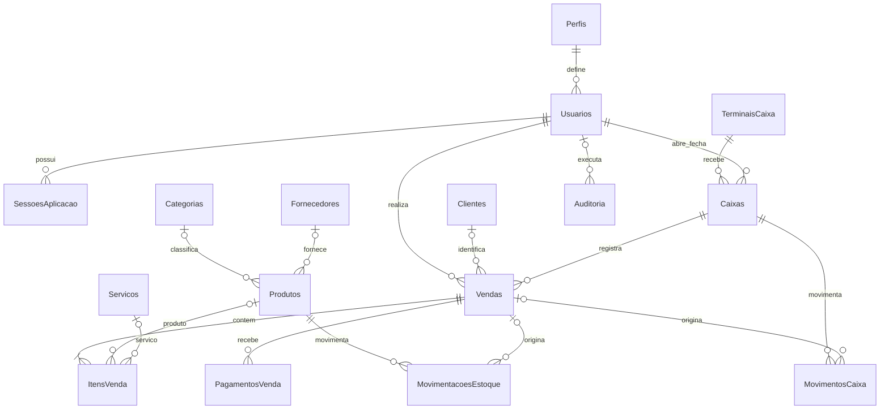

# Relacionamentos

`ItensVenda.TipoItem` distingue P (produto) de S (serviço). Cada linha aponta para exatamente um produto ou serviço, conforme as constraints da estrutura existente. Preço, custo e descrição do item vendido representam a data da venda. Configuracoes é um registro único com código 1. Não há exclusão de cadastros pela interface; a inativação mantém os relacionamentos históricos.
